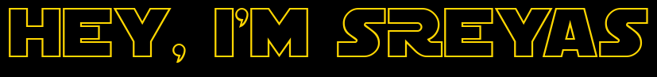

<h1 align="center">
<!--   <a href="https://git.io/typing-svg"></a> -->
  
</h1>

<p align="center"> 
<!--    <br> -->
  
</p>

<p>
  
```rust
fn main() {
    let me = Info {
        name: "Sreyas ✨",
        from: "India 🇮🇳",
        fav_lang: "Rust 🦀",
        age: Box::new(|current_year: u32| -> u32 {
            current_year - 2003
        }),
        system: System {
            kernel: "Linux 🤓",
            os: Distro {
                name: "Arch linux",
                kernel_v: cmd("$(uname -r | cut -d"-" -f1)"),  // 6.17.6
                shell: "Fish",
            },
            prev_distro: vec!["Fedora", "Ubuntu", "EndeavourOS", "ZorinOS"],
        },
        dev: Dev {
            programming: Programming {
                languages: Languages {
                    knows: vec!["TypeScript", "Javascript", "Python", "C", "C++", "Java", "Bash", "PHP", "Rust 🦀"],
                },
                web_development: WebDevelopment {
                    knows: {
                        let mut map = HashMap::new();
                        map.insert("frontEnd", vec!["React", "Javascript", "JQuery", "TailwindCSS", "HTML", "CSS", "SCSS", "SASS"]);
                        map.insert("backEnd", vec!["Express", "NestJS", "PHP", "NodeJS", "Flash ⚡"]); // Just kidding, Actually I know it's Flask 🤫.
                        map.insert("fullStack", vec!["NextJS"]); 
                        map.insert("lib", vec!["Redux", "React-router-dom", "Tanstack Query", "Zustand", "Shadcn"]);
                        map
                    }
                },
                db: vec!["Supabase", "PostgreSQL", "MongoDB", "MySql", "MariaDB", "OracleDB", "Firebase"],
            },
        },
        tools: Tools {
            design: vec!["Figma"],
            workflow: vec!["Git", "Github"],
        },
        editors: vec!["Zed ❤️", "VScode", "VIM ⚡", "NeoVim 🔥"],
        browsers: vec!["Zen", "Firefox", "Chrome"],
    };

    println!("{:#?}", me);
}

```
  
</p>

<div align="center">
  
🔥 **Coding is so much Fun, Do you feel the same?**

**Reach Me**

<a href="https://instagram.com/s.r.e_y.a.s">
    
</a>
<a href="mailto:sreyas.dev.contact@gmail.com">
    
</a>
<a href="https://www.leetcode.com/imsreyas">
    
</a>
<a href="https://dribbble.com/im_sreyas">
    
</a>

</div>
<br>

<h2 align="center">Languages, Frameworks, Tools</h2>

<div align="center">
  <br>
   <br>
  
  <br><br>
  
  **`Learning`**
  
  
</div>
<br>
<h2 align="center">My Contributions 🐉</h2>

<!-- <div align="center">
  
</div>
 -->
<div align="center">
  


</div>


<h2 align="center">Stats ⚡</h2>
<div align="center">
  
  
  
</div>

